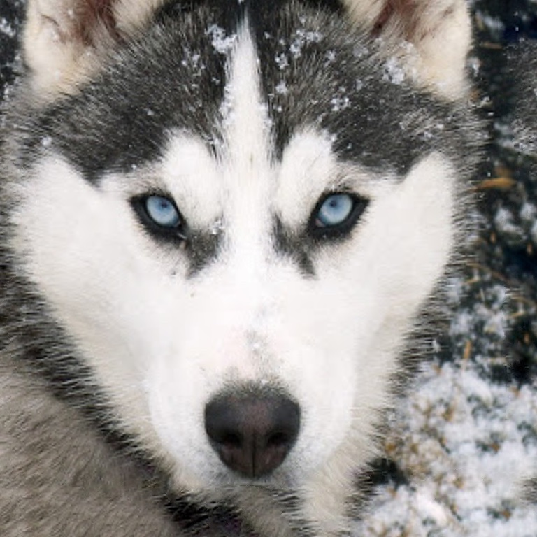
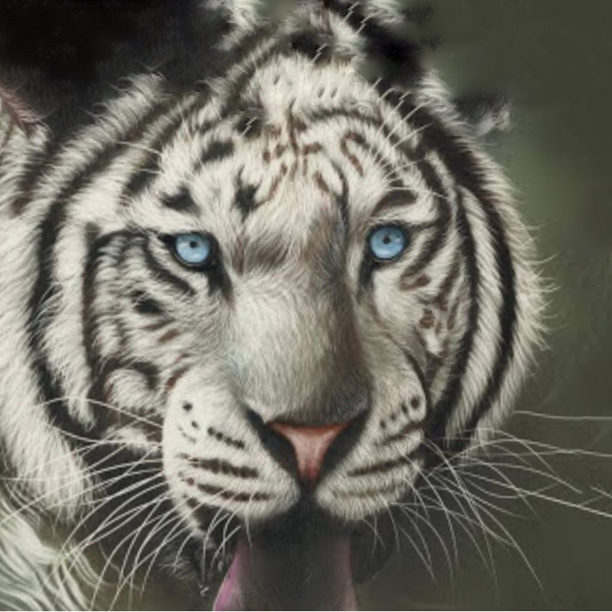
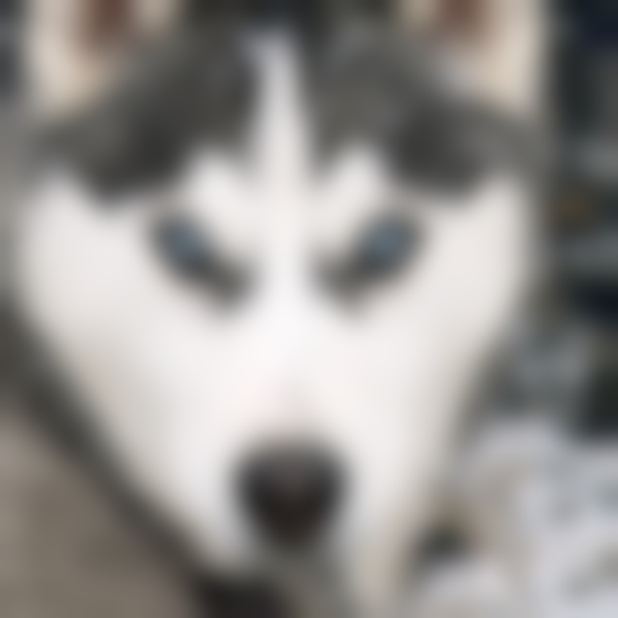
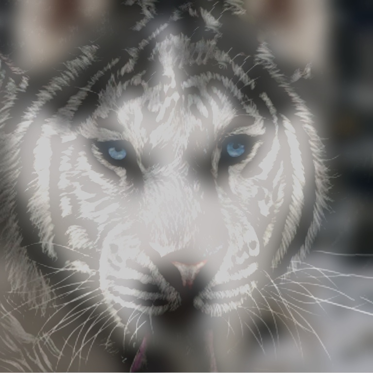

<h1>目录</h1>

[toc]

# 1. 实验概述


​		混合图像是一种生成具有两种解释的静态图像的技术，利用人类视觉的多尺度感知机制来创建视觉错觉(即混合图像)，我们通过改变观看距离就可以观测到不同的图像。


##  1.1 实验目的

1. 学习高通、低通滤波器的原理；
2. 了解OpenCV相关知识，巩固课堂内容。


## 1.2 实验内容

​		阅读 Hybrid images 论文，使用 OpenCV 制作混合图像。

> ​	通过组合两个图像(I~1~和I~2~)获得混合图像(H)，其中一个通过低通滤波器(G~1~)过滤，第二个通过由高通滤波器(1-G~2~)限制：$H = I_1 \cdot G_1 + I_2 \cdot (1-G_2）$。混合图像由两个参数定义：低分辨率图像的频率切割（在远距离处可以看到）和高分辨率图像的频率切割（在近处可以看到）。可以通过为每个频道引入不同的增益来添加附加参数。对于本文显示的混合动力，我们将两个空间通道的增益都设置为1。我们将高斯滤波器（G~1~和G~2~）用于低通和高通滤波器。我们将每个滤波器的截止频率定义为滤波器的幅度增益为1/2的频率。
>
> ​	图2说明了用于创建一个混合图像的过程。可以根据图像大小和滤光片的截止频率（确定）完全确定最佳观察混合图像的每个分量的距离和混合感知交替的距离。 以周期/图像为单位）。

# 2. 实验步骤


## 2.1 图像选择

​		了解Hybrid images实现原理可知，两张图像其中一张做模糊处理，获取低频信息；另一张进行边缘检测，获取高频信息。因此，为了获得较好的Hybrid结果，我选择边缘轮廓较为明显的、方便识别到边缘的图像作为第二张图片。

​		最终选择图像如下：





## 2.1 低通滤波

​		opencv提供了几种低通滤波器，采用论文中提到的高斯滤波器处理图像1。通过控制 $\sigma$ 可以控制低通滤波的截止频率。

* 主要代码

```c++
// 选择比较大的sigma值
int sigma = 17;  // 不断尝试后认为获得最终hybrid视觉效果最佳的数值
int ksize = sigma*3;  // 高斯核大小

GaussianBlur(src1, dst1, Size(ksize, ksize), sigma, sigma);
// src1: "that2y.jpg"
```

* 图像处理结果




## 2.2 高通滤波

​		实际上，opencv也提供了几种高通滤波器(如拉普拉斯)，这里采用论文中所述，使用原图减去高斯滤波后的图像，得到图像的高频信息。因此，用高斯滤波器处理图像2，然后使用原图减去处理后的图像即可。

* 主要代码

```c++
Mat tmp;
GaussianBlur(src2, tmp, Size(ksize, ksize), sigma, sigma);
// src2: “thaty.jpg”
dst2 = src2 - tmp;
// absdiff(src2, tmp, dst2);
// absdiff效果没直接相减效果好
```

* 图像处理结果


## 2.3 图像融合

​		opencv提供了addWeighted()函数支持图像融合，在这里我们采用论文中所示直接将图像(数组)相加即可，主要在图像叠加之前需要使用resize()函数调整两张图片的大小使之一致。

* 主要代码

```c++
resize(dst2, dst2, Size(dst1.cols, dst1.rows));

dst = dst1 + dst2;
dst.convertTo(dst, -1, 0.8, 0); // 稍微修饰一下所得图像的对比度和亮度
```

* 图像处理结果

  近距离看更像虎，一定远的距离看更像狼：




## 2.4 测试效果

​		另外，也可使用opencv提供的pyrDown()函数将所得混合图像缩小：

* 主要代码(可重复缩小操作)

```c++
pyrDown(dst, pydn, Size(dst.cols/2, dst.rows/2));
imshow("pydn1", pydn);
```

* 结果如下

  图像越小看起来越像狼，越大看起来越像虎：


# 3. 实验结论和感想

​		实验过程比较简单，主要是要理解混合图像形成这样的效果的原因。Hybrid images是一个非常有意思的实验，虽然用到的技术很简单，却达到了很奇妙的效果。通过此次实验，我不仅加深了对OpenCV的了解，也提高了对计算机视觉技术的兴趣。